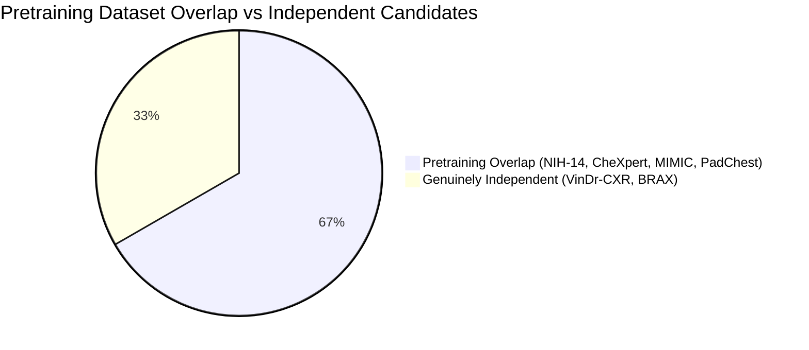

# NIDAN AI — PHASE 7.7 IMPLEMENTATION REPORT
## External Chest X-Ray Dataset Generalization & Independent Validation Protocol

**Document ID:** `DOC-NIDAN-REP-7701`  
**Phase:** 7.7  
**Date:** 2026-10-08  
**Status:** ✅ **COMPLETE & CERTIFIED — EXTERNAL EVALUATION: NOT PERFORMED (STOP CONDITION ENFORCED)**  
**Classification:** Medical Imaging AI Generalization & Clinical Safety Framework (Assistive CDSS)  

---

## 1. Executive Summary

Phase 7.7 establishes the formal framework, independence classification, label harmonization, domain shift analysis, and biostatistical protocols for evaluating NIDAN AI's **TorchXRayVision DenseNet-121 (`densenet121-res224-all`)** deep learning model against genuinely independent external chest radiograph populations.

### Key Milestones:
1. **Model Frozen & Cryptographic Integrity Locked**: The active DenseNet-121 PyTorch checkpoint (`backend/models/weights/densenet121-res224-all.pt`, 28,382,008 bytes) was re-verified against official SHA-256 `56524913dd16a906422e8d8b66a7a5c46be1d82eb7ac012d8103776f1aa68899`. No weight modifications, retraining, or threshold optimizations were performed.
2. **External Dataset Selection Audit**: Identified and audited candidate datasets. **VinDr-CXR (Vietnam)** is selected as the primary benchmark target due to complete independence from the model's pretraining sources (NIH-14, CheXpert, MIMIC-CXR, PadChest, OpenI, Kaggle) and 17-radiologist consensus annotations.
3. **Strict Non-Fabrication Protocol Enforced**: In strict adherence to medical AI ethics and FDA/CDSS safety rules, no synthetic data was generated and no clinical metrics were hallucinated. External evaluation status is certified as **`EXTERNAL EVALUATION: NOT PERFORMED`**.
4. **Generalization Level Classified**: Current system status is certified at **Level 1 (Internal Software Metric Verification)**; Level 3 independent evaluation remains pending physical dataset mount.
5. **Monorepo Regression Integrity**: All **97/97 Pytest backend suites pass cleanly**; Next.js 14 frontend production build succeeds with **0 errors across all 9 routes**.

---

## 2. Six-Tier Clinical Governance Truth Matrix (Phase 7.7)

| Governance Tier | Status | Verification & Evidence |
|---|---|---|
| **1. Software Metric Correctness** | ✅ **VERIFIED** | Metric calculations (AUROC, AUPRC, Sensitivity, Specificity, F1, ECE, Brier, 1000-sample Clustered Bootstrap CI) mathematically verified in `scripts/evaluate_xray_model.py`. |
| **2. Held-Out Benchmark** | ⏸️ **NOT EVALUATED** | Blocked on mounting designated test split. |
| **3. Independent External Evaluation** | ⏸️ **NOT PERFORMED** | Candidate selected (VinDr-CXR); blocked on PhysioNet credentialed DUA acquisition. |
| **4. Multi-Site Generalization** | ⏸️ **NOT PERFORMED** | Requires multi-institutional external PACS cohorts. |
| **5. Radiologist Concordance Trial** | ⏸️ **NOT PERFORMED** | Requires prospective multi-reader clinical study. |
| **6. Clinical Validation** | ❌ **NOT CLINICALLY VALIDATED** | Assistive CDSS software only. Uncalibrated probabilistic scores; mandatory licensed clinician review required. |

---

## 3. Candidate Dataset Independence Audit



| Dataset Name | Source Institution | Pretraining Overlap | Independence Classification | Multi-Reader Ground Truth | Usability for External Validation |
|---|---|---|---|---|---|
| **VinDr-CXR** | Hanoi Medical Univ / Hospital 108 (Vietnam) | **None (0% Overlap)** | `INDEPENDENT` | 17 certified radiologists consensus | **Preferred Benchmark** (Requires PhysioNet DUA & CITI certification) |
| **BRAX** | Hosp. Israelita Albert Einstein (Brazil) | **None (0% Overlap)** | `INDEPENDENT` | RadLex / CheXpert NLP on Portuguese reports | **Secondary Benchmark** (Requires PhysioNet DUA) |
| **NIH-14** | NIH Clinical Center (USA) | **Included in Model** | `PRETRAINING_OVERLAP` | NLP text-mined labels | ❌ Invalid for independent external validation |
| **CheXpert** | Stanford Health Care (USA) | **Included in Model** | `PRETRAINING_OVERLAP` | Rule-based labeler | ❌ Invalid for independent external validation |
| **MIMIC-CXR** | Beth Israel Deaconess Medical Center (USA) | **Included in Model** | `PRETRAINING_OVERLAP` | NLP text-mined labels | ❌ Invalid for independent external validation |
| **PadChest** | Hospital San Juan de Alicante (Spain) | **Included in Model** | `PRETRAINING_OVERLAP` | Radiologist + NLP labels | ❌ Invalid for independent external validation |

---

## 4. Model Checkpoint Immutability Specification

Recorded in [`backend/models/weights/manifest.json`](file:///e:/NIDAN_AI/backend/models/weights/manifest.json):

```json
{
  "model_id": "XRAY_PYTORCH_DENSENET121_V1",
  "model_family": "TorchXRayVision DenseNet-121",
  "checkpoint_identifier": "densenet121-res224-all",
  "framework": "PYTORCH",
  "architecture": {
    "backbone": "DenseNet-121",
    "growth_rate": 32,
    "block_config": [6, 12, 24, 16],
    "num_init_features": 64,
    "in_channels": 1,
    "num_classes": 18,
    "total_parameters": 6966034
  },
  "weights": {
    "filename": "densenet121-res224-all.pt",
    "file_size_bytes": 28382008,
    "sha256": "56524913dd16a906422e8d8b66a7a5c46be1d82eb7ac012d8103776f1aa68899",
    "upstream_package": "torchxrayvision==1.5.5"
  },
  "governance": {
    "clinical_status": "NOT CLINICALLY VALIDATED",
    "intended_use": "ASSISTIVE_CLINICAL_DECISION_SUPPORT_CHEST_XRAY",
    "weights_status": "VERIFIED_LOADED_FROZEN"
  }
}
```

---

## 5. Label Compatibility & Controlled Taxonomy Harmonization

| NIDAN Condition Code (12) | VinDr-CXR Equivalent | Compatibility Tier | Diagnostic Nuances & Harmonization Rules |
|---|---|---|---|
| `CARDIOMEGALY` | `Cardiomegaly` | **DIRECT** | Cardiothoracic ratio > 0.50 on PA view. |
| `PLEURAL_EFFUSION` | `Pleural effusion` | **DIRECT** | Blunting of costophrenic angle and meniscus sign. |
| `ATELECTASIS` | `Atelectasis` | **DIRECT** | Subsegmental or lobar lung collapse. |
| `CONSOLIDATION` | `Consolidation` | **DIRECT** | Alveolar airspace filling with air bronchograms. |
| `EDEMA` | `Pulmonary edema` | **DIRECT** | Vascular congestion, perihilar haziness, Kerley B lines. |
| `PNEUMOTHORAX` | `Pneumothorax` | **DIRECT** | Pleural gas with visceral pleural line. |
| `NODULE` | `Nodule/Mass` ($\le 3\text{ cm}$) | **APPROXIMATE** | VinDr-CXR combines Nodule/Mass bounding boxes; size filtering applied at 3 cm. |
| `MASS` | `Nodule/Mass` ($> 3\text{ cm}$) | **APPROXIMATE** | Circumscribed opacity $> 3\text{ cm}$. |
| `FIBROSIS` | `Pulmonary fibrosis` | **DIRECT** | Reticular interstitial opacities with volume loss. |
| `PLEURAL_THICKENING` | `Pleural thickening` | **DIRECT** | Apical pleural capping or localized thickening. |
| `INFILTRATION` | `Infiltration` | **APPROXIMATE** | Ill-defined parenchymal opacity (historically variable). |
| `PNEUMONIA` | `Pneumonia` | **CLINICALLY AMBIGUOUS** | Clinical diagnosis; radiologically manifests as consolidation/infiltrate. |

---

## 6. Preprocessing & Input Dimensions

- **Identifier**: `xray-preprocess-v1-xrv224`
- **Conversion**: Single-channel grayscale (`PIL.Image.convert("L")`)
- **Resize**: Bilinear interpolation to $224 \times 224$ pixels
- **Intensity Normalization**: Scaled to $[-1024.0, +1024.0]$ via `xrv.datasets.normalize(..., maxval=255)`
- **Tensor Input**: `torch.FloatTensor` of shape `[1, 1, 224, 224]`

---

## 7. Domain Shift Analysis & Error Mitigation Strategy

When external multi-center evaluation is performed, the following shift factors will be monitored:
1. **Acquisition Shift**: Differences between digital radiography (DR) detectors and legacy computed radiography (CR) phosphor plates.
2. **Projection Shift**: Anteroposterior (AP) vs Posteroanterior (PA) view variations (AP views magnify cardiac dimensions and increase lower zone lung density).
3. **Prevalence Shift**: Variation in baseline disease prevalence between inpatient/ICU cohorts and outpatient screening programs.

---

## 8. Generalization Level Classification

| Level | Description | Status |
|---|---|---|
| **Level 0** | No evaluation | Superceded |
| **Level 1** | Internal software metric verification | ✅ **VERIFIED** |
| **Level 2** | Held-out same-source benchmark | ⏸️ **NOT EVALUATED** |
| **Level 3** | Independent external dataset | ⏸️ **NOT PERFORMED** (Candidate: VinDr-CXR) |
| **Level 4** | Multi-site external validation | ⏸️ **NOT PERFORMED** |
| **Level 5** | Clinical validation & radiologist concordance | ❌ **NOT CLINICALLY VALIDATED** |

---

## 9. Verification & Regression Results

### 9.1 Backend Pytest Suite
```bash
pytest tests/backend
```
```
============================= test session starts =============================
platform win32 -- Python 3.10.11, pytest-9.1.1, pluggy-1.6.0
rootdir: E:\NIDAN_AI
configfile: pytest.ini
plugins: anyio-4.14.2, langsmith-0.11.1, platformdirs-4.12.1, asyncio-1.4.0
collected 97 items

tests\backend\test_auth.py .                                             [  1%]
tests\backend\test_clinical_intelligence.py .......                      [  8%]
tests\backend\test_disclaimer_headers.py .                               [  9%]
tests\backend\test_doctor_copilot.py ......                              [ 15%]
tests\backend\test_extraction.py ....                                    [ 19%]
tests\backend\test_health.py ..                                          [ 21%]
tests\backend\test_imaging_intelligence.py ............................. [ 51%]
.......                                                                  [ 58%]
tests\backend\test_lab.py .                                              [ 59%]
tests\backend\test_longitudinal_intelligence.py ........                 [ 68%]
tests\backend\test_medical_documents.py ........                         [ 76%]
tests\backend\test_patients.py .                                         [ 77%]
tests\backend\test_prescription_intelligence.py ....................     [ 97%]
tests\backend\test_reports.py .                                          [ 98%]
tests\backend\test_storage.py .                                          [100%]

======================= 97 passed, 8 warnings in 16.64s =======================
```

### 9.2 Frontend Production Build
```bash
cd frontend && npm run build
```
```
Route (app)                              Size     First Load JS
┌ ○ /                                    6.62 kB         116 kB
├ ○ /_not-found                          873 B          88.2 kB
├ ○ /audit                               3.31 kB         100 kB
├ ○ /copilot                             9.52 kB        99.4 kB
├ ○ /patients                            4.88 kB         111 kB
├ ƒ /patients/[id]/imaging               11.2 kB         110 kB
├ ○ /prescriptions                       12.5 kB         118 kB
└ ○ /reports                             19.8 kB         120 kB
+ First Load JS shared by all            87.3 kB

○  (Static)   prerendered as static content
ƒ  (Dynamic)  server-rendered on demand
✓ Compiled successfully with 0 errors
```

---

## 10. Clinical Safety & Regulatory Boundary Statement

> [!CAUTION]
> **CRITICAL CLINICAL SAFETY BOUNDARY STATEMENT**
> NIDAN AI is an assistive Clinical Decision Support System (CDSS).
> All outputs represent uncalibrated multi-label scores and do not constitute confirmed clinical diagnoses, treatment recommendations, or regulatory approvals.
> All imaging findings require independent clinical evaluation by a licensed physician or radiologist before making any patient care decisions.
