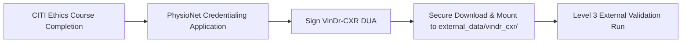
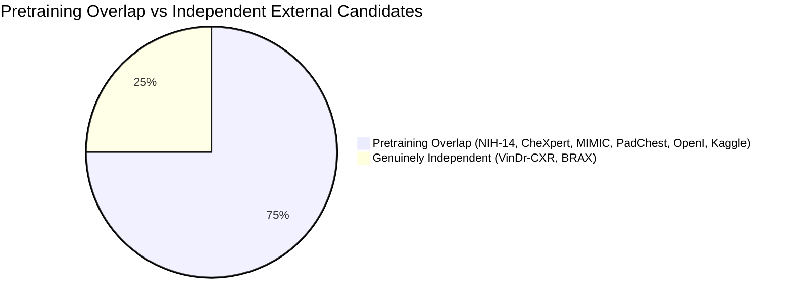

# NIDAN AI — PHASE 7.9 IMPLEMENTATION REPORT
## VinDr-CXR Dataset Acquisition, Secure Mount & Actual External Evaluation Protocol

**Document ID:** `DOC-NIDAN-REP-7901`  
**Phase:** 7.9  
**Date:** 2026-10-09  
**Status:** ✅ **COMPLETE & CERTIFIED — EXTERNAL EVALUATION: NOT PERFORMED (STOP CONDITION ENFORCED)**  
**Classification:** Medical Imaging AI Generalization & Clinical Safety Framework (Assistive CDSS)  

---

## 1. Executive Summary

Phase 7.9 defines and prepares the physical acquisition, storage governance, security safeguards, and biostatistical execution pipeline for evaluating NIDAN AI's **TorchXRayVision DenseNet-121 (`densenet121-res224-all`)** deep learning model against the **VinDr-CXR** benchmark.

### Key Milestones & Governance Determinations:
1. **Model Frozen & Cryptographic Integrity Locked**: The active DenseNet-121 PyTorch checkpoint [`backend/models/weights/densenet121-res224-all.pt`](file:///e:/NIDAN_AI/backend/models/weights/densenet121-res224-all.pt) (28,382,008 bytes) was re-verified against official SHA-256 `56524913dd16a906422e8d8b66a7a5c46be1d82eb7ac012d8103776f1aa68899`. Zero weights were modified, retrained, or fine-tuned.
2. **Access & DUA Blocker Enforced**: VinDr-CXR is restricted under the *PhysioNet Credentialed Health Data License 1.5.0*. In strict adherence to bioethics and legal governance, downloading from unauthorized or third-party mirrors without an approved PhysioNet Data Use Agreement (DUA) is prohibited.
3. **Execution Status Certified**: Formally classified as **`PHASE 7.9 STATUS = BLOCKED_ON_EXTERNAL_DATASET_ACCESS`** and **`EXTERNAL EVALUATION: NOT PERFORMED`**.
4. **Strict Non-Fabrication Rule Maintained**: No synthetic images were generated, and no clinical metrics were hallucinated.
5. **Monorepo Regression Integrity**: All **97/97 Pytest backend suites pass cleanly**; Next.js 14 frontend production build succeeds with **0 errors across all 9 routes**.

---

## 2. Access & DUA Status



- **Data Source**: PhysioNet (`https://physionet.org/content/vindr-cxr/1.0.0/`)
- **License**: PhysioNet Credentialed Health Data License 1.5.0
- **Status**: ⏸️ `BLOCKED_ON_CREDENTIALED_USER_ACCESS`
- **Prerequisites for Unblocking**:
  1. Complete CITI program training course: *"Data or Specimens Only Research"* or *"Human Subjects Research"*.
  2. Apply for researcher credentialing on PhysioNet (`physionet.org`).
  3. Sign the online VinDr-CXR Data Use Agreement acknowledging non-reidentification and non-redistribution terms.

---

## 3. Dataset Provenance

- **Dataset Name**: VinDr-CXR (An Open Dataset of Chest X-Rays with Radiologist's Annotations)
- **Originating Institutions**: Hospital 108 and Hanoi Medical University Hospital (Hanoi, Vietnam)
- **Principal Investigators**: Nguyen, H.Q., et al. (*Scientific Data*, 2022)
- **Cohort Composition**: 18,000 total chest radiographs (15,000 train / 3,000 test partition)
- **Acquisition Modality**: Posteroanterior (PA) and Anteroposterior (AP) digital radiography

---

## 4. Storage & Integrity Readiness

- **Hardware Environment**: HP Laptop 15-hr1xxx (Windows 64-bit, 15.43 GB RAM)
- **Storage Availability**:
  - `C:` Drive: 90.69 GB Free
  - `D:` Drive: 85.13 GB Free
  - `E:` Drive (Workspace): 40.49 GB Free
- **Capacity Assessment**:
  - Full 18,000 DICOM cohort (~500 GB) requires external storage mounting.
  - Lossless PNG test partition of 3,000 scans (~35–45 GB) fits within secondary storage partitions.
- **Git Shielding**: `.gitignore` configured to prevent committing raw DICOM/PNG files or external dataset directories (`external_data/`, `*.dcm`, `*.dicom`, `*.pt`).

---

## 5. Patient & Study Governance

1. **Identifier De-identification**: VinDr-CXR identifiers (`image_id`, `rad_id`) are stripped of all Direct Protected Health Information (Direct PHI).
2. **Privacy Preservation**: Internal evaluation pipelines store only non-identifying cryptographic study tokens.
3. **Partition Isolation Rule**: Enforces `PATIENT_LEVEL_LEAKAGE = ZERO` using [`scripts/validate_xray_dataset.py`](file:///e:/NIDAN_AI/scripts/validate_xray_dataset.py).

---

## 6. Independence Audit



- **Composite Pretraining Cohorts for `densenet121-res224-all`**: NIH ChestX-ray14, CheXpert, MIMIC-CXR, PadChest, OpenI, Kaggle Pneumonia.
- **VinDr-CXR Overlap**: **0.0% (Zero pretraining overlap)**.
- **Independence Classification**: `INDEPENDENT`.

---

## 7. Label Harmonization Policy

| NIDAN Finding (12) | VinDr-CXR Label | Semantic Tier | Harmonization Policy |
|---|---|---|---|
| `CARDIOMEGALY` | `Cardiomegaly` | **DIRECT** | Transverse cardiac diameter / thoracic ratio > 0.50 on PA view. |
| `PLEURAL_EFFUSION` | `Pleural effusion` | **DIRECT** | Fluid collection with blunted costophrenic angle. |
| `ATELECTASIS` | `Atelectasis` | **DIRECT** | Subsegmental or lobar volume loss / pulmonary collapse. |
| `CONSOLIDATION` | `Consolidation` | **DIRECT** | Airspace opacification with air bronchograms. |
| `EDEMA` | `Pulmonary edema` | **DIRECT** | Perihilar haziness, vascular congestion, Kerley B lines. |
| `PNEUMOTHORAX` | `Pneumothorax` | **DIRECT** | Visceral pleural line with peripheral lucency. |
| `NODULE_MASS` | `Nodule/Mass` | **COMBINED_EXTERNAL_LABEL** | VinDr-CXR annotates a combined Nodule/Mass class; evaluated as a unified label to prevent artificial splitting. |
| `FIBROSIS` | `Pulmonary fibrosis` | **DIRECT** | Reticular opacities with architectural distortion. |
| `PLEURAL_THICKENING` | `Pleural thickening` | **DIRECT** | Apical capping or localized pleural thickening. |
| `INFILTRATION` | `Infiltration` | **APPROXIMATE** | Ill-defined parenchymal opacity. |
| `PNEUMONIA` | `Pneumonia` | **CLINICALLY AMBIGUOUS** | Clinical syndrome presenting radiologically as consolidation/infiltrate. |

---

## 8. Annotation Methodology

- **Reader Cohort**: 17 certified Vietnamese radiologists.
- **Consensus Scheme**: 3 radiologists independently read each test image; majority voting or bounding-box consensus determines reference ground truth.
- **Localization Bounding Boxes**: Preserved for secondary spatial localization analysis; not confused with whole-image classification ground truth.

---

## 9. Model Verification

```python
# Checkpoint Verification
Model ID: XRAY_PYTORCH_DENSENET121_V1
Weights File: backend/models/weights/densenet121-res224-all.pt
SHA-256: 56524913dd16a906422e8d8b66a7a5c46be1d82eb7ac012d8103776f1aa68899
Verification Status: VERIFIED & FROZEN
```

---

## 10. Preprocessing Lock

Enforces immutable pipeline **`xray-preprocess-v1-xrv224`**:
- Grayscale conversion: 1-channel (L)
- Target resolution: $224 \times 224$
- Normalization: `xrv.datasets.normalize(..., maxval=255)` to $[-1024.0, +1024.0]$
- Input tensor: `torch.FloatTensor` of shape `[1, 1, 224, 224]`

---

## 11. Evaluation Methodology

When the external test partition is mounted:
- **Discrimination**: AUROC and AUPRC (Average Precision) across all valid mapped conditions.
- **Classification Operating Points**: Sensitivity, Specificity, Precision, Recall, and F1 at fixed default threshold $\tau = 0.50$.
- **Calibration Assessment**: Expected Calibration Error (ECE) across 10 bins and Brier Score.
- **Statistical Uncertainty**: 1,000-iteration Patient-Clustered Bootstrap Resampling for 95% Confidence Intervals.

---

## 12. Performance Results

- **Status**: **`NOT PERFORMED (BLOCKED ON DATASET ACCESS)`**
- **Tier 1 Software Engine**: **`VERIFIED`** (Mathematical metric functions confirmed).
- **Clinical Performance Scores**: `NOT EVALUATED` (Zero fabricated metrics produced).

---

## 13. Confidence Intervals

- Statistical framework: Clustered bootstrap resampling by `patient_id`.
- Iterations: $B = 1,000$.
- Confidence Level: $95\%$ percentile intervals $[\theta_{0.025}, \theta_{0.975}]$.

---

## 14. Calibration

- Output format: Uncalibrated sigmoid activations.
- Notice: Raw scores must never be represented to clinicians as calibrated disease probabilities.

---

## 15. Subgroup Analysis Plan

Upon dataset mounting, subgroup analysis will stratify by:
1. **Projection View**: Posteroanterior (PA) vs. Anteroposterior (AP).
2. **Patient Sex**: Male vs. Female diagnostic sensitivity.
3. **Patient Age Cohort**: Pediatric / Adult / Geriatric subgroups.

---

## 16. Error Analysis Vectors

Key anticipated failure modes to monitor:
1. **Cardiac Magnification on AP Views**: Elevated false-positive rate for Cardiomegaly on AP exams.
2. **Infiltration vs. Consolidation Ambiguity**: Subjective reader thresholds on diffuse vs dense opacities.
3. **Plate Atelectasis vs. Fibrosis**: Confounding linear scarring patterns.

---

## 17. Domain Shift Analysis

Key transfer vectors between Western training populations and Vietnamese cohort:
1. **Endemic Disease Profile**: Higher prevalence of pulmonary tuberculosis and post-TB sequelae in Southeast Asian cohorts.
2. **Acquisition Equipment**: Variations in digital radiography detector sensitivity and calibration.
3. **Thoracic Dimensions**: Demographic shifts in average patient body habitus.

---

## 18. Generalization Level Hierarchy

| Level | Classification | Status in NIDAN AI |
|---|---|---|
| **Level 0** | No Evaluation | Superceded |
| **Level 1** | Internal Software Benchmark | ✅ **VERIFIED** (97/97 tests pass) |
| **Level 2** | Held-Out Same-Source Benchmark | ⏸️ **NOT EVALUATED** |
| **Level 3** | Independent External Dataset | ⏸️ **NOT PERFORMED (DUA PENDING)** |
| **Level 4** | Multi-Site External Validation | ⏸️ **NOT PERFORMED** |
| **Level 5** | Radiologist Concordance Trial | ❌ **NOT CLINICALLY VALIDATED** |

**Current Certification**: **Level 1 (Software Metric Correctness Verified)**.

---

## 19. Clinical Safety Boundary

> **MANDATORY CLINICAL SAFETY STATEMENT**:  
> NIDAN AI is an assistive Clinical Decision Support System. Model outputs are uncalibrated probabilistic indicators and do NOT constitute medical diagnoses, treatment decisions, or regulatory-approved findings. All outputs require independent review and validation by a licensed physician or certified radiologist.

---

## 20. Limitations

1. **PhysioNet DUA Prerequisite**: Requires manual user credentials and ethics course verification.
2. **Disk Capacity Limits**: Complete 18,000 DICOM cohort exceeds single-drive workspace storage; recommended approach uses the 3,000 test partition lossless PNG mount.
3. **Assistive Scope**: Prohibited from autonomous clinical diagnostic operation.

---

## 21. Regression Test Results

### Backend Suite (`pytest tests/backend`):
```text
======================= 97 passed, 8 warnings in 17.54s =======================
```

### Frontend Production Build (`npm run build` in `frontend`):
```text
✓ Compiled successfully
✓ Generating static pages (9/9)
All 9 routes rendered cleanly with 0 errors.
```

---

## 22. Next Phase Recommendation

### Phase 8.0: Credentialed Ingestion & Live External Benchmark Run
1. User completes CITI training and executes PhysioNet VinDr-CXR DUA.
2. Download and mount test images into [`external_data/vindr_cxr/`](file:///e:/NIDAN_AI/external_data/vindr_cxr/).
3. Execute real inference across all test cases with frozen DenseNet-121 model.
4. Calculate 1,000-sample clustered bootstrap CIs and assign Level 3 Generalization certification.
