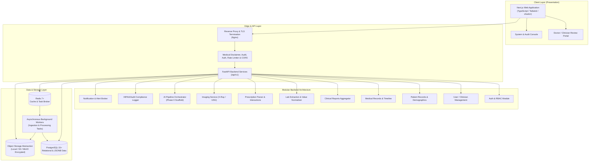

# NIDAN AI System Architecture

**Tagline**: *Intelligent Clinical Insights*  
**Scope**: Production-Oriented Clinical Decision-Support Platform (Phase 0 Foundation)

---

## 1. Important Medical & Legal Guardrail

> [!CAUTION]
> **NIDAN AI is NOT a doctor replacement.**  
> It must **never** independently provide a definitive medical diagnosis, prescription, or treatment decision.  
> It operates strictly as an **assistive Clinical Decision-Support System (CDSS)** for qualified medical practitioners.

All responses, payloads, and UI views enforce the mandatory disclaimer:
`"NIDAN AI provides assistive clinical insights for licensed medical professionals. It is not an automated diagnostic system."`

---

## 2. High-Level System Architecture

---

## 3. Key Subsystems

### 3.1. Frontend (Next.js & shadcn/ui)
- **Framework**: Next.js (App Router), React 19, TypeScript.
- **Styling**: Tailwind CSS with clinical dark/light mode palette, modern responsive design.
- **Components**: Accessible UI primitives (cards, badges, modals, status indicators, timeline).
- **Clinical Views**:
  - Doctor Ingestion & Upload Hub (PDFs, DICOM/Images, Prescriptions).
  - Patient Longitudinal Timeline.
  - Abnormality Flagging & Laboratory Trend Explorer.
  - Clinical Audit Logs & Disclaimer Badges.

### 3.2. Backend (FastAPI & Modular Domain Architecture)
- **Framework**: FastAPI (Async Python 3.10+).
- **Pydantic V2**: Strict schema validation, typed settings, JSON serialization.
- **SQLAlchemy 2.0 (Async)**: Clean repository/service pattern with async session pooling.
- **Modularity**: Domain-driven directory layout where each module encapsulates its own models, schemas, services, and endpoints.
  - `medical_documents`: Secure document ingestion, multi-layer validation, server-side SHA-256 calculation, duplicate prevention, background OCR extraction pipeline, and doctor verification workbench.
- **Centralized Middleware**:
  - `DisclaimerHeaderMiddleware`: Injects CDSS clinical disclaimer headers (`X-CDSS-Disclaimer`, `X-CDSS-Confidence-Policy`) on all responses.
  - `AuditLoggingMiddleware`: Logs access and modifications for HIPAA/GDPR auditability.
  - `GlobalErrorHandler`: Standardized RFC 7807 problem details response.

### 3.3. OCR & Medical Document Extraction Engine (Phase 2)
- **Pipeline**: `DocumentPreprocessor` $\rightarrow$ `OCRRouter` $\rightarrow$ `OCRProvider` (PDF direct text vs Tesseract/Cloud OCR) $\rightarrow$ `MedicalEntityExtractor` $\rightarrow$ `UnitNormalizer` $\rightarrow$ `ConfidenceCalculator` $\rightarrow$ `DocumentExtractionEntities`.
- **Controlled Clinical Vocabulary**: Deterministic mappings for 8 major laboratory panels (CBC, Glucose, Renal, Liver, Lipid, Thyroid, Iron, Vitamins) with zero fake medical hallucinations.
- **Provenance & Review**: Full source page, bounding box (when available), and source text line tracking with clinician Accept/Edit/Reject workflow.

### 3.5. Clinical Anomaly Detection & Blood Report Intelligence Engine (Phase 3)
- **Pipeline**: Extracted Entities $\rightarrow$ Priority-Governed Reference Range Resolver $\rightarrow$ Unit-Aware Validation $\rightarrow$ Abnormality Classification $\rightarrow$ Critical Threshold Alerting $\rightarrow$ Deficiency Marker Detection $\rightarrow$ Deterministic Multi-Marker Pattern Engine $\rightarrow$ Safety Guardrail Validator $\rightarrow$ Clinician Review Workbench.
- **Priority-Governed Reference Range Engine**: Demographic-aware catalog (CLSI, WHO, ADA, KDIGO, AASLD, NCEP, ATA) prioritized: Doctor Reviewed > Report Provided > Configured Knowledge Base > Unknown/Demographic Unresolved.
- **Multi-Marker Pattern Detection**: Deterministic evaluation of concordant panels (Iron deficiency, Macrocytic, Glycemic, Renal-function, Hepatic) with complete evidence provenance.
- **Safety Validator**: Strict regex & rule-based CDSS filter barring autonomous disease diagnoses, treatments, or medication prescriptions.
- **Longitudinal Tracking**: Clean time-series aggregation for Hemoglobin, Creatinine, HbA1c, Vitamin D, ALT, AST, and TSH over historical patient report encounters.

### 3.6. Asynchronous Worker & Queue
- **Task Broker**: Redis Task Broker / InMemory test broker.
- **Worker**: Background document preparation worker (`process_medical_document`) inspecting PDF page counts, image dimensions, OCR routing, and structured extraction without blocking HTTP threads.

### 3.7. Object Storage Abstraction
- Unified interface `BaseStorageService` supporting:
  - Local disk storage (sandboxed development & air-gapped deployments).
  - S3 / MinIO storage (production enterprise clouds).
- UUID-based isolated paths (`patients/{patient_id}/documents/{uuid}/original.{ext}`). Zero public URL exposure.

### 3.8. Longitudinal Patient Intelligence & Multi-Visit Summary Engine (Phase 4)
- **Pipeline**: Normalized Clinical Observations $\rightarrow$ Encounter Date Resolution Priority $\rightarrow$ Deterministic Trend Trajectory $\rightarrow$ Abnormality Dynamics Engine (Persistent, New, Resolved, Recurring, Fluctuating) $\rightarrow$ Panel Completeness Analysis $\rightarrow$ Cross-Visit Comparison Engine $\rightarrow$ Longitudinal Summary Engine $\rightarrow$ Provenance Linking $\rightarrow$ Doctor Longitudinal Review Notes.
- **Normalized Observation Model**: `clinical_observations` indexed on patient, observation date, canonical name, and document, supporting 100+ encounters without memory bloat.
- **Observation Date Resolution**: Strict hierarchy (`REPORT_DATE` > `TEST_DATE` > `DOCUMENT_DATE` > `UPLOAD_TIMESTAMP` > `UNKNOWN`).
- **Abnormality Dynamics**: Identifies persistent abnormalities across encounters, newly emergent findings, normalized values, and multi-visit fluctuations.
- **Panel Completeness**: Detects partial panels (e.g. CBC, KFT, LFT, Lipid, Thyroid) and explicitly prevents assuming unmeasured tests are normal.
- **Multi-Visit Clinical Summary**: Generates section-by-section summaries with traceable evidence provenance ("Why did NIDAN AI conclude this?").
- **Clinician Review Notes**: Allows licensed medical professionals to append timestamped longitudinal clinical annotations with full audit trail.

