# NIDAN AI Database & Persistence Strategy

## 1. Database Engine
- **Primary Database**: PostgreSQL 15+
- **Async Driver**: `asyncpg` via SQLAlchemy 2.0 AsyncSession.
- **Migration Tool**: Alembic (automated versioning with async execution hooks).

## 2. Relational vs Unstructured (Hybrid Schema)
Medical systems balance strict clinical standardization with highly heterogeneous diagnostic payloads:
- **Core Entities (Relational)**: Patients, Clinicians, Encounters, Audit Events, Notifications, Permissions.
- **Semi-Structured Payloads (PostgreSQL `JSONB`)**:
  - Raw OCR / Document extraction tokens and bounding boxes.
  - Granular lab panel measurements and multi-tier reference intervals.
  - Multi-specialty prescription instructions and compounding notes.
  - AI extraction confidence scores and human-in-the-loop doctor verification stamps.

## 3. High-Level Entity Relationship Model

```mermaid
erDiagram
    USERS ||--o{ AUDIT_LOGS : performs
    USERS ||--o{ PATIENTS : manages
    PATIENTS ||--o{ MEDICAL_DOCUMENTS : has
    MEDICAL_DOCUMENTS ||--o{ DOCUMENT_EXTRACTIONS : extracts
    MEDICAL_DOCUMENTS ||--o{ DOCUMENT_EXTRACTION_ENTITIES : contains
    DOCUMENT_EXTRACTIONS ||--o{ DOCUMENT_EXTRACTION_ENTITIES : produces
    MEDICAL_DOCUMENTS ||--o{ CLINICAL_ANALYSES : evaluates
    DOCUMENT_EXTRACTIONS ||--o{ CLINICAL_ANALYSES : feeds
    CLINICAL_ANALYSES ||--o{ CLINICAL_FINDINGS : contains
    PATIENTS ||--o{ CLINICAL_ANALYSES : belongs_to
    PATIENTS ||--o{ CLINICAL_FINDINGS : belongs_to
    PATIENTS ||--o{ MEDICAL_RECORDS : has
    MEDICAL_RECORDS ||--o{ REPORTS : contains
    REPORTS ||--o{ LAB_RESULTS : generates
    REPORTS ||--o{ PRESCRIPTIONS : generates
    REPORTS ||--o{ IMAGING_STUDIES : generates
    REPORTS ||--o{ AI_ANALYSIS_JOBS : analyzed_by

    REFERENCE_RANGES {
        uuid id PK
        string analyte
        string canonical_name
        string panel
        string sex
        float age_min
        float age_max
        string pregnancy_status
        string unit
        float lower_bound
        float upper_bound
        float critical_low
        float critical_high
        string source_name
        string source_version
        boolean is_active
    }

    CLINICAL_ANALYSES {
        uuid id PK
        uuid patient_id FK
        uuid document_id FK
        uuid extraction_id FK
        integer analysis_version
        string rule_set_version
        string reference_range_version
        string status
        integer findings_count
        integer abnormal_count
        integer critical_count
        integer pattern_count
        jsonb summary_metadata
    }

    CLINICAL_FINDINGS {
        uuid id PK
        uuid analysis_id FK
        uuid patient_id FK
        uuid document_id FK
        uuid extraction_id FK
        uuid entity_id FK
        string finding_type
        string analyte
        string value
        float normalized_value
        string unit
        string status
        string severity
        string title
        text explanation
        text clinical_association
        jsonb evidence
        float confidence
        string rule_id
        string rule_version
        string reference_source
        boolean requires_review
        string review_status
        uuid reviewed_by FK
        datetime reviewed_at
        text reviewer_notes
    }

    MEDICAL_DOCUMENTS {
        uuid id PK
        uuid patient_id FK
        uuid uploaded_by FK
        string original_filename
        string stored_filename
        string storage_key
        string mime_type
        integer file_size
        string sha256_hash
        string document_type
        string processing_status
        string processing_error
        string storage_provider
        integer page_count
        jsonb doc_metadata
        boolean is_deleted
        datetime uploaded_at
        datetime processed_at
        datetime created_at
        datetime updated_at
    }

    DOCUMENT_EXTRACTIONS {
        uuid id PK
        uuid document_id FK
        integer extraction_version
        string provider
        string provider_version
        string status
        text raw_text
        jsonb raw_blocks
        jsonb raw_tables
        string language
        integer page_count
        integer processing_time_ms
        text error
        datetime created_at
        datetime updated_at
    }

    DOCUMENT_EXTRACTION_ENTITIES {
        uuid id PK
        uuid extraction_id FK
        uuid document_id FK
        string entity_type
        string raw_name
        string canonical_name
        string value_text
        float numeric_value
        string original_unit
        string normalized_unit
        string reference_range_text
        float reference_min
        float reference_max
        string technical_status
        float confidence
        integer page_number
        jsonb bounding_box
        text source_text
        string review_status
        string reviewed_value
        uuid reviewed_by FK
        datetime reviewed_at
        datetime created_at
        datetime updated_at
    }


    USERS {

        uuid id PK
        string email UK
        string full_name
        string role
        string license_number
        boolean is_active
        datetime created_at
    }

    PATIENTS {
        uuid id PK
        string mrn UK
        string first_name
        string last_name
        date date_of_birth
        string gender
        string blood_group
        jsonb emergency_contact
        datetime created_at
    }

    MEDICAL_RECORDS {
        uuid id PK
        uuid patient_id FK
        uuid clinician_id FK
        string record_type
        string clinical_summary
        string status
        datetime recorded_at
    }

    REPORTS {
        uuid id PK
        uuid medical_record_id FK
        uuid patient_id FK
        string document_type
        string storage_key
        string file_name
        string mime_type
        integer file_size_bytes
        string checksum_sha256
        string extraction_status
        datetime created_at
    }

    LAB_RESULTS {
        uuid id PK
        uuid report_id FK
        uuid patient_id FK
        string panel_name
        string analyte_name
        float value
        string unit
        float ref_low
        float ref_high
        string interpretation
        boolean is_abnormal
        boolean is_critical
    }

    PRESCRIPTIONS {
        uuid id PK
        uuid report_id FK
        uuid patient_id FK
        string drug_name
        string dosage
        string frequency
        string route
        integer duration_days
        string raw_instructions
    }

    IMAGING_STUDIES {
        uuid id PK
        uuid report_id FK
        uuid patient_id FK
        string modality
        string body_part
        string dicom_series_uid
        string storage_key
        jsonb clinical_findings
    }

    AI_ANALYSIS_JOBS {
        uuid id PK
        uuid report_id FK
        string job_status
        string pipeline_version
        jsonb extracted_insights
        jsonb flagged_abnormalities
        boolean doctor_verified
        uuid verified_by_clinician_id FK
        datetime verified_at
    }

    CLINICAL_OBSERVATIONS {
        uuid id PK
        uuid patient_id FK
        uuid document_id FK
        uuid extraction_id FK
        uuid entity_id FK
        string analyte
        string canonical_name
        string value
        float normalized_value
        string unit
        datetime observation_date
        string observation_date_source
        string date_confidence
        string technical_status
        float reference_min
        float reference_max
        boolean is_doctor_verified
        datetime created_at
    }

    LONGITUDINAL_ANALYSES {
        uuid id PK
        uuid patient_id FK
        integer analysis_version
        string trend_rule_version
        string summary_version
        integer observation_count
        integer visit_count
        datetime start_date
        datetime end_date
        text summary_text
        jsonb metadata_json
        datetime created_at
    }

    LONGITUDINAL_TRENDS {
        uuid id PK
        uuid analysis_id FK
        uuid patient_id FK
        string analyte
        string canonical_name
        string direction
        string trend_status
        string dynamics_classification
        float first_value
        float last_value
        float absolute_change
        float percentage_change
        integer persistence_count
        jsonb history_points
    }

    LONGITUDINAL_SUMMARY_SECTIONS {
        uuid id PK
        uuid analysis_id FK
        uuid patient_id FK
        string section_type
        string title
        text generated_text
        jsonb evidence_ids
        jsonb source_documents
        string generated_by
        string safety_validation_status
    }

    LONGITUDINAL_REVIEW_NOTES {
        uuid id PK
        uuid patient_id FK
        uuid analysis_id FK
        uuid author_id FK
        text note
        datetime created_at
    }
```

## 4. Partitioning & Indexing Strategy
1. **B-Tree Indexes**: `patient_id`, `mrn`, `created_at`, `extraction_status`.
2. **Phase 4 Longitudinal Indexes**:
   - `clinical_observations`: Indexed on `patient_id`, `observation_date`, `analyte`, `canonical_name`, `document_id`, `technical_status`, `normalized_value`.
   - `longitudinal_trends`: Indexed on `analysis_id`, `patient_id`, `analyte`, `canonical_name`, `direction`, `trend_status`, `dynamics_classification`.
   - `longitudinal_summary_sections`: Indexed on `analysis_id`, `patient_id`, `section_type`.
3. **GIN Indexes**: Specialized `jsonb_path_ops` on `extracted_insights` and `flagged_abnormalities` for high-throughput anomaly querying.
4. **Partitioning**:
   - `AUDIT_LOGS` partitioned quarterly by `created_at` for regulatory archiving and zero-downtime roll-offs.
   - `CLINICAL_OBSERVATIONS` composite indexed by `(patient_id, canonical_name, observation_date)` for instant multi-visit longitudinal queries supporting 1,000+ observations per patient.

## 5. Soft Delete & Immutability Policy
- Medical history records are **never hard-deleted** in production.
- `is_deleted` and `deleted_at` timestamps protect audit trails.
- Longitudinal analyses and doctor review notes are **immutable snapshots** with version increments (`analysis_version`, `trend_rule_version`).