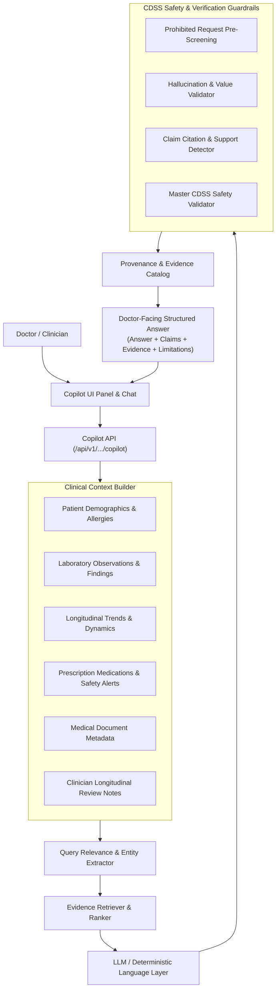

# NIDAN AI — Doctor AI Copilot & Evidence-Grounded Assistant (Phase 6)

> **NOTICE**: *Software implementation verified. Clinical validation remains a separate medical/regulatory requirement.*

---

## 1. Overview & CDSS Guardrails

The **NIDAN AI Doctor Copilot** provides evidence-grounded decision support assistance for licensed medical professionals. It queries the verified patient record across all preceding phases:
- **Phase 1**: Secure Document Ingestion & Integrity Metadata
- **Phase 2**: OCR Medical Extraction & Normalization
- **Phase 3**: Clinical Anomaly Detection & Priority Reference Ranges
- **Phase 4**: Longitudinal Trajectories & Multi-Visit Abnormality Dynamics
- **Phase 5**: Prescription Extraction & Multi-Engine Medication Safety
- **Phase 7**: Medical Imaging Intelligence & Chest X-Ray Analysis Foundation

### Strict Safety Boundaries (CDSS Level 1 & Level 2)
The Doctor Copilot is **never an autonomous medical decision-maker**. The system strictly enforces:
- **Zero Autonomous Diagnoses**: Does not state "Patient has disease X". Instead surfaces: *"Observation X was documented; clinical correlation is recommended."*
- **Zero Prescribing**: Does not generate prescriptions, recommend starting/stopping drugs, or propose dosage titrations.
- **Zero Hallucinations**: Rejects any clinical numeric values or diagnostic claims not present in the verified patient record.
- **Strict Evidence Provenance**: Every factual claim is bound to deterministic evidence IDs (`EVID-LAB-...`, `EVID-MED-...`, `EVID-SAFETY-...`, `EVID-TREND-...`, `EVID-XRAY-...`) for one-click clinician drilldown.
- **Prompt Injection Defense**: Medical reports and OCR blocks are treated strictly as untrusted text data, ignoring any embedded instructions or jailbreak attempts.

---

## 2. Architecture & Pipeline

---

## 3. Database Schema

- `copilot_sessions`: Patient-isolated conversation sessions with status, versioning, and clinician assignment.
- `copilot_messages`: Immutable conversation turns storing query, structured JSON response, evidence citations, safety audit flags, and latency.
- `copilot_feedback`: Clinician feedback (`HELPFUL`, `NOT_HELPFUL`, `EVIDENCE_INCORRECT`, `MISSING_EVIDENCE`, `UNSAFE_WORDING`).

---

## 4. RESTful API Reference

All endpoints enforce JWT Bearer authentication, RBAC (`PHYSICIAN`, `CLINICIAN`, `SUPER_ADMIN`), patient data isolation, and CDSS disclaimer headers.

| Method | Endpoint | Description |
| :--- | :--- | :--- |
| `POST` | `/api/v1/patients/{patient_id}/copilot/sessions` | Create a new clinical session |
| `GET` | `/api/v1/patients/{patient_id}/copilot/sessions` | List sessions for a patient |
| `GET` | `/api/v1/copilot/sessions/{session_id}` | Get session details and message history |
| `POST` | `/api/v1/copilot/sessions/{session_id}/messages` | Send question inside an active session |
| `POST` | `/api/v1/patients/{patient_id}/copilot/query` | Direct query on patient verified record |
| `GET` | `/api/v1/copilot/messages/{message_id}` | Get specific message details |
| `GET` | `/api/v1/copilot/messages/{message_id}/evidence` | Get full clinical evidence items for a message |
| `POST` | `/api/v1/copilot/messages/{message_id}/feedback` | Submit clinician feedback |

---

## 5. Verification & Benchmark

- **Backend Pytest Suite**: 61/61 tests passing across Phases 0–6.
- **Deterministic Copilot Benchmark**: 28/28 test cases passing (100% score) across 10 evaluation categories (`scripts/evaluate_doctor_copilot.py`).
- **Frontend Build**: Next.js 14 App Router production build passing with 0 errors.
