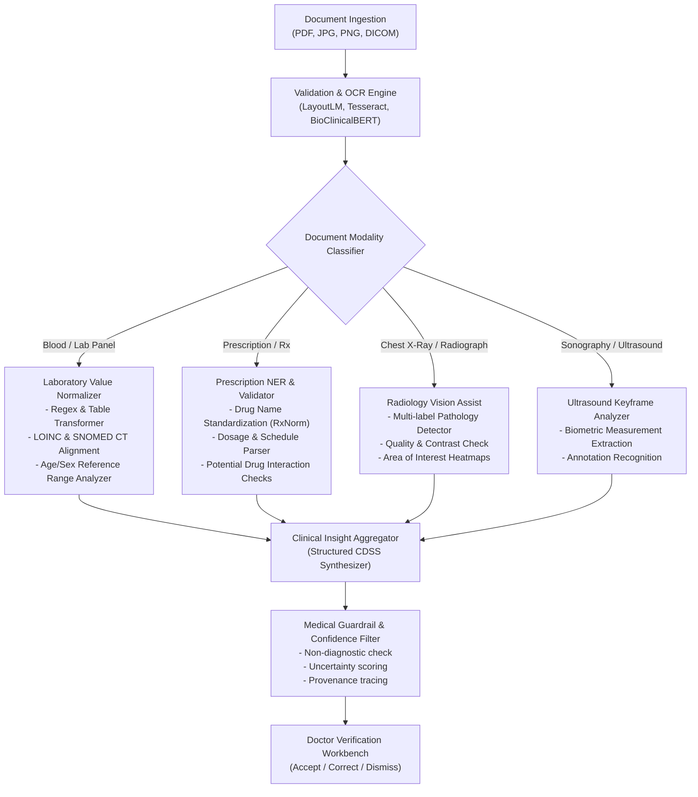

# NIDAN AI Future AI Pipeline Architecture

> [!NOTE]
> **Phases 1, 2 & 3 Status**: Ingestion (Phase 1), OCR & Structured Medical Extraction (Phase 2), and Clinical Anomaly Detection & Blood Report Intelligence Engine (Phase 3) are fully active, deterministic, and verified. Imaging assistance and natural language synthesis remain for subsequent phases.

---

## 1. Modality-Specific AI Processing Pipelines

When fully integrated in subsequent phases, NIDAN AI will employ a multi-modal ensemble pipeline:

---

## 2. Core Functional Pillars

### 2.1. Laboratory Value Extraction & Normalization
- **Standard Terminologies**: Mapping extracted entities to **LOINC** (Logical Observation Identifiers Names and Codes) and **UCUM** (Unified Code for Units of Measure).
- **Dynamic Reference Ranges**: Adjusting alert thresholds based on patient age, biological sex, pregnancy status, and known comorbidities.
- **Longitudinal Trend Detection**: Comparing current values against historical patient trajectory (e.g., progressive eGFR decline or sudden Troponin spike).

### 2.2. Prescription Information Extraction
- **RxNorm & ATC Ontology Mapping**: Resolving brand names to active pharmaceutical ingredients (APIs).
- **Dosage Safety Flags**: Identifying potential contraindications, duplicate therapies, or abnormal dosing regimens.

### 2.3. Imaging Assist (X-Rays & Sonography)
- **Visual Heatmaps (Grad-CAM)**: Providing explainable attention overlays rather than black-box labels.
- **Structured Findings**: Assisting radiologists by automatically measuring anatomical ratios (e.g. cardiothoracic ratio) and extracting radiologist impressions from unstructured text reports.

### 2.4. Longitudinal Clinical Summarizer
- Assembling multi-visit records into a coherent chronological summary (chief complaints, active medications, key lab anomalies, and diagnostic procedures) to accelerate clinical review prior to patient consultation.

---

## 3. Strict Guardrails & Safety Architecture
1. **Zero Hallucination Tolerance**: Every claim generated by LLMs must cite exact spans in the uploaded source document.
2. **Deterministic Fallbacks**: Deterministic rule engines validate numerical lab results independently of probabilistic language models.
3. **Audit Immutability**: All model inferences, confidence scores, and subsequent physician overrides are logged for clinical provenance.
