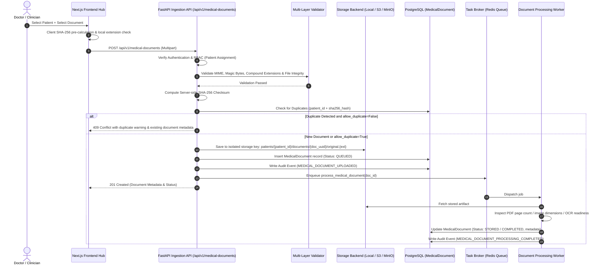

# Medical Document Ingestion & Secure Upload Pipeline (Phase 1)

## 1. Overview & Purpose
Phase 1 of **NIDAN AI** provides an enterprise-grade, HIPAA-compliant document ingestion pipeline. It allows authorized clinical users (Doctors, Clinical Staff, Admins) to upload medical documents (`PDF`, `PNG`, `JPG`, `JPEG`, `WEBP`) associated with a specific patient, performs multi-layered binary and structural validation, computes immutable SHA-256 integrity hashes, securely stores the artifacts in isolated storage, queues background metadata extraction tasks, and maintains an unalterable PHI access audit log.

**Core Clinical Safety Rule:** Phase 1 performs strictly safe, non-diagnostic document intake and structural inspection. No autonomous clinical diagnosis, disease prediction, laboratory extraction, or LLM reasoning is performed in this phase.

---

## 2. Ingestion Architecture Workflow



---

## 3. Multi-Layer File Security & Validation

1. **File Extension & MIME Filtering**:
   - Only `application/pdf`, `image/png`, `image/jpeg`, and `image/webp` are permitted.
   - Enforces single, validated extension against a strict whitelist. Double extensions (`.pdf.exe`, `.png.php`) are explicitly blocked.
2. **File Signature / Magic Byte Inspection**:
   - Every file's raw initial byte sequence is inspected independently of HTTP headers:
     - PDF: `%PDF-` (`0x25 0x50 0x44 0x46 0x2D`)
     - PNG: `\x89PNG\r\n\x1a\n`
     - JPEG: `\xFF\xD8\xFF`
     - WEBP: `RIFF....WEBP`
3. **Deep Structural Integrity Verification**:
   - PDFs are parsed with `pypdf.PdfReader` to verify uncorrupted header, trailer, and xref tables.
   - Images are verified with `PIL.Image.verify()` to catch truncated streams, zip bombs, and disguised payload scripts.
4. **Path Traversal & Filename Sanitization**:
   - Filenames with traversal tokens (`../`, `..\\`, `C:\`, null bytes, control characters) are rejected immediately.
   - Files are stored using internal UUID-based storage keys: `patients/{patient_id}/documents/{uuid}/original.{ext}`. Original client filenames are preserved strictly as metadata.
5. **Configurable Size Limits**:
   - Governed by `MAX_UPLOAD_SIZE_MB` (default 25 MB) to protect against memory exhaustion and Denial-of-Service attacks.

---

## 4. SHA-256 Integrity & Duplicate Management

- **Server-Side Integrity Calculation**: The server reads file chunks in 64KB blocks, independently calculating the SHA-256 digest (`hashlib.sha256()`).
- **Duplicate Prevention Policy**:
  - Uniqueness scope: `patient_id` + `sha256_hash`.
  - Accidental re-uploads are intercepted before duplicate disk storage occurs.
  - The system returns HTTP 409 Conflict with the original upload metadata (`existing_document_id`, `uploaded_at`), allowing clinicians to make an informed decision to proceed with `allow_duplicate=true` or cancel.

---

## 5. Storage Abstraction & Privacy Safeguards

- Implements `BaseStorageService` with pluggable drivers:
  - `LocalStorageService`: Local sandboxed filesystem with atomic stream writes.
  - `S3StorageService`: AWS S3 object storage with server-side encryption.
  - `MinIOStorageService`: S3-compatible on-premise object storage.
- **Zero Public Access**:
  - Medical documents are never placed in public buckets or static web roots.
  - File retrieval (`GET /api/v1/medical-documents/{id}/download`) is mediated by authenticated API endpoints verifying user RBAC and patient access rules, streaming bytes securely with short-lived access lifecycles.

---

## 6. Document States & Lifecycle

```text
[UPLOADED] ──> [VALIDATING] ──> [STORED] ──> [QUEUED] ──> [PROCESSING] ──> [COMPLETED]
     │               │                                          │
     └──> [REJECTED] <──┘                                          └──> [FAILED]
```

- **UPLOADED**: File received in memory stream.
- **VALIDATING**: Magic bytes, dimensions, and structural integrity checked.
- **STORED**: Safely committed to internal object/file storage with SHA-256 verified.
- **QUEUED**: Job scheduled in Redis Task Broker.
- **PROCESSING**: Worker actively extracting structural metadata (page count, scan status).
- **COMPLETED**: Metadata saved, ready for clinical review or Phase 2 OCR.
- **REJECTED**: File failed validation or duplicate rejected.
- **FAILED**: Storage or metadata extraction failure.

---

## 7. Deterministic Classification & Phase 2 OCR Hand-off

For Phase 1, `DocumentClassifier` applies deterministic rule-based heuristics:
- MIME types (e.g., DICOM/imaging vs PDFs).
- PDF header/metadata keyword density markers (e.g., "Complete Blood Count", "Hemoglobin", "Prescription", "Ultrasound").
- Filename hints as low-weight secondary signals.
- If signals are inconclusive, the document is tagged `UNKNOWN`, prompting clinician confirmation.

### Phase 2 Readiness
The background processor prepares the structural foundation for Phase 2:
- Detects `page_count`.
- Flags `has_embedded_text` vs `is_scanned_document`.
- Extracts image `width`, `height`, and `format`.
- In Phase 2, this metadata will directly route documents to Tesseract OCR, AWS Textract, or Vision models for clinical extraction.

---

## 8. Audit Logging & Access Control (RBAC)

All document lifecycle events emit immutable audit records:
- `MEDICAL_DOCUMENT_UPLOAD_STARTED`
- `MEDICAL_DOCUMENT_UPLOADED`
- `MEDICAL_DOCUMENT_VIEWED`
- `MEDICAL_DOCUMENT_DOWNLOADED`
- `MEDICAL_DOCUMENT_DELETED`
- `MEDICAL_DOCUMENT_PROCESSING_STARTED`
- `MEDICAL_DOCUMENT_PROCESSING_COMPLETED`
- `MEDICAL_DOCUMENT_PROCESSING_FAILED`

Audit logs record `user_id`, `patient_id`, `document_id`, `action`, `status`, and `ip_address` while strictly avoiding logging raw document contents or sensitive auth tokens.
