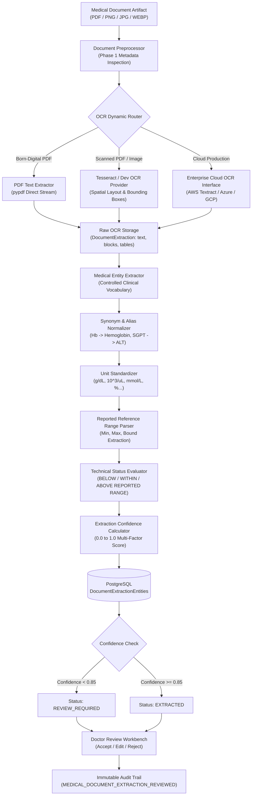

# NIDAN AI — OCR & Medical Document Extraction Engine (Phase 2)

## 1. Overview & Purpose
Phase 2 of **NIDAN AI** (*Intelligent Clinical Insights*) introduces the **OCR + Medical Document Extraction Engine**. It transforms raw, heterogeneous medical files (`PDF`, `PNG`, `JPG`, `JPEG`, `WEBP`) into structured, verifiable clinical data with strict provenance tracking, unit normalization, reported reference range extraction, confidence scoring, and human-in-the-loop doctor verification.

> [!CAUTION]
> **Strict Clinical Safety Guardrail:**
> Phase 2 extracts factual parameters reported in medical documents. It **does NOT** diagnose disease, **does NOT** recommend medications or treatments, and **does NOT** infer clinical syndromes from isolated laboratory metrics. Status comparisons are strictly technical evaluations against reference ranges reported in the source document.

---

## 2. End-to-End Extraction Pipeline Architecture

---

## 3. OCR Provider Abstraction & Dynamic Routing

The pipeline uses the abstract interface [`BaseOCRProvider`](file:///e:/NIDAN_AI/backend/app/modules/medical_documents/extraction/base.py#L36-L43):
- **[`PDFTextExtractor`](file:///e:/NIDAN_AI/backend/app/modules/medical_documents/extraction/providers.py#L27-L70)**: High-speed, loss-less direct text stream extractor for digital PDFs.
- **[`TesseractOCRProvider`](file:///e:/NIDAN_AI/backend/app/modules/medical_documents/extraction/providers.py#L72-L140)**: Image OCR provider utilizing Tesseract OCR with bounding box coordinates.
- **[`DevelopmentOCRProvider`](file:///e:/NIDAN_AI/backend/app/modules/medical_documents/extraction/providers.py#L142-L190)**: Robust fallback provider handling PDF parsing and development environments with zero fake medical hallucinations.
- **[`ProductionCloudOCRProvider`](file:///e:/NIDAN_AI/backend/app/modules/medical_documents/extraction/providers.py#L192-L203)**: Extensible interface for enterprise AWS Textract, Azure Document Intelligence, or Google Vision.

### Routing Logic
- If `mime_type == "application/pdf"` and document has embedded text and is not scanned $\rightarrow$ `PDFTextExtractor`.
- If `mime_type == "application/pdf"` and is scanned $\rightarrow$ OCR engine.
- If `mime_type` is image (`PNG`, `JPEG`, `WEBP`) $\rightarrow$ Image OCR engine.

---

## 4. Controlled Medical Vocabulary & Analyte Normalization

Medical laboratories use varied naming conventions. NIDAN AI implements a controlled dictionary rather than probabilistic fuzzy guesses:

### Supported Analyte Panels:
1. **Complete Blood Count (CBC)**: Hemoglobin, RBC, WBC, Platelets, Hematocrit, MCV, MCH, MCHC, RDW, Neutrophils, Lymphocytes, Monocytes, Eosinophils, Basophils.
2. **Glucose Metabolism**: Glucose (Random), Fasting Blood Sugar (FBS), Post Prandial Blood Sugar (PPBS), HbA1c.
3. **Kidney Function (KFT / Renal)**: Creatinine, Blood Urea, BUN, eGFR, Sodium, Potassium, Chloride.
4. **Liver Function (LFT)**: Total Bilirubin, Direct Bilirubin, AST (SGOT), ALT (SGPT), Alkaline Phosphatase (ALP), Albumin, Total Protein.
5. **Lipid Profile**: Total Cholesterol, LDL, HDL, Triglycerides, VLDL.
6. **Thyroid Function**: TSH, T3, T4, Free T3, Free T4.
7. **Iron & Ferritin**: Ferritin, Serum Iron, TIBC, Transferrin, Transferrin Saturation.
8. **Vitamins**: Vitamin B12, Vitamin D (25-OH).

### Controlled Synonym Resolution
- `Hb`, `Hgb`, `Hemoglobin`, `Haemoglobin`, `हिमोग्लोबिन`, `હિમોગ્લોબિન` $\rightarrow$ `Hemoglobin`
- `SGPT`, `ALT`, `Alanine Transaminase` $\rightarrow$ `ALT`
- `SGOT`, `AST`, `Aspartate Transaminase` $\rightarrow$ `AST`
- `TLC`, `Total Leukocyte Count`, `WBC` $\rightarrow$ `WBC`
- `FBS`, `Fasting Glucose`, `Fasting Blood Sugar` $\rightarrow$ `Fasting Blood Sugar`

---

## 5. Unit Normalization & Reference Range Parsing

### Unit Normalization
All detected units are mapped to standardized clinical symbols:
- `g/dl`, `gm/dl`, `g%` $\rightarrow$ `g/dL`
- `10^3/ul`, `thousand/ul`, `cells/cumm`, `/cumm` $\rightarrow$ `10^3/uL` or `/uL`
- `uiu/ml`, `µiu/ml`, `miu/l` $\rightarrow$ `uIU/mL`
- `mg/dl`, `mg%` $\rightarrow$ `mg/dL`

### Reference Range & Technical Status
- Extracts intervals (`13.0 - 17.0 g/dL`, `0.6 to 1.2`), upper bounds (`< 200 mg/dL`), and lower bounds (`> 40 mg/dL`).
- Computes **Technical Status**:
  - `BELOW_REPORTED_RANGE`
  - `WITHIN_REPORTED_RANGE`
  - `ABOVE_REPORTED_RANGE`
  - `UNKNOWN` (when no reference range is provided in the source report)

---

## 6. Provenance & Confidence Calculation

Every entity preserves exact provenance:
- `page_number`: Document page index.
- `bounding_box`: Exact spatial coordinates (`{ x, y, width, height }`) if provided by OCR.
- `source_text`: Exact raw line text snippet from which the value was extracted.

### Multi-Factor Extraction Confidence
Confidence is strictly labeled `extraction_confidence` (not clinical confidence):
$$\text{Confidence} = 0.40 \cdot \text{OCR\_Quality} + 0.30 \cdot \text{Term\_Match} + 0.15 \cdot \text{Numeric\_Parse} + 0.10 \cdot \text{Unit\_Valid} + 0.05 \cdot \text{Range\_Present}$$

---

## 7. Doctor Review Workflow & Audit Trail

When low confidence ($< 0.85$) or unverified data exists:
1. Extraction status is marked `REVIEW_REQUIRED`.
2. Authorized clinicians review extracted parameters on the split-screen Workbench.
3. Clinician actions:
   - **Accept**: Marks parameter verified by physician.
   - **Edit**: Allows physician to correct numeric value or unit while retaining original extraction.
   - **Reject**: Marks parameter rejected.
4. An immutable audit log (`MEDICAL_DOCUMENT_EXTRACTION_REVIEWED`) is recorded with previous state, new state, reviewer ID, and timestamp.

---

## 8. API Endpoints

- `POST /api/v1/medical-documents/{id}/extract`: Enqueues extraction job (idempotent retry).
- `GET /api/v1/medical-documents/{id}/extraction`: Fetches full raw OCR extraction and entity summary.
- `GET /api/v1/medical-documents/{id}/extraction/entities`: Paginated clinical entities with provenance, confidence, and review filters.
- `PATCH /api/v1/medical-documents/{id}/extraction/entities/{entity_id}`: Submits doctor review decision (`ACCEPTED`, `EDITED`, `REJECTED`).

---

## 9. Multilingual Preparation
The vocabulary dictionary includes foundational mappings for:
- English
- Hindi (`हिमोग्लोबिन`, `ग्लूकोज`, `क्रेटिनिन`)
- Gujarati (`હિમોગ્લોબિન`)

Text is preserved in its original language without uncontrolled translations, ensuring direct clinical traceability.

---

## 10. Phase 3 Integration Readiness
Phase 2 provides verified, structured clinical entities (`DocumentExtractionEntity`) ready for **Phase 3: Clinical Anomaly Detection & Longitudinal Trend Analysis**:
- Normalized numeric values and canonical names ready for patient timeline charts.
- Technical status flags ready for physician anomaly highlights.
- Provenance coordinates ready for side-by-side clinical summary views.
