# NIDAN AI — Phase 7.6 Held-Out Dataset Evaluation & Audit Document
## Real Held-Out Chest X-Ray Dataset Evaluation & Clinical AI Governance Protocol

**Document ID:** `DOC-NIDAN-AUD-7601`  
**Phase:** 7.6  
**Date:** 2026-10-08  
**Classification:** Medical Imaging AI Governance & Evaluation Protocol (Assistive CDSS)  
**Status:** ✅ **GOVERNANCE AUDIT COMPLETED — HELD-OUT PERFORMANCE: NOT EVALUATED (STOP CONDITION ENFORCED)**  

---

## 1. Executive Summary & Core Governance Principles

Phase 7.6 establishes the formal clinical AI evaluation framework, dataset provenance audit, patient leakage safeguards, label semantic compatibility verification, and statistical confidence estimation protocols for the **TorchXRayVision DenseNet-121 (`densenet121-res224-all`)** deep learning model in NIDAN AI.

In accordance with strict clinical AI ethics and regulatory guidelines:
1. **Zero Metric Fabrication Rule**: No synthetic data has been presented as clinical evaluation. No AUROC, sensitivity, specificity, or F1 metrics have been invented or hallucinated.
2. **Absolute Stop Condition**: Because no external independent clinical radiograph test split is currently mounted in the repository environment, the held-out benchmark performance is formally certified as **`NOT EVALUATED`**.
3. **Software Correctness Verified**: The metric calculation harness (`scripts/evaluate_xray_model.py`), patient leakage validator (`scripts/validate_xray_dataset.py`), uncertainty policy handler, and bootstrap confidence interval calculator are fully verified and passing all software tests.

---

## 2. Model Specification & Checkpoint Provenance

The evaluation target is the verified Phase 7.5 PyTorch model artifact:

| Property | Value / Verification |
|---|---|
| **Model ID** | `XRAY_PYTORCH_DENSENET121_V1` |
| **Model Family** | TorchXRayVision DenseNet-121 (`densenet121-res224-all`) |
| **Checkpoint File** | `backend/models/weights/densenet121-res224-all.pt` |
| **File Size** | 28,382,008 bytes (27.07 MB) |
| **SHA-256 Checksum** | `56524913dd16a906422e8d8b66a7a5c46be1d82eb7ac012d8103776f1aa68899` (Cryptographically Verified) |
| **Parameters** | 6,966,034 total weights (growth rate $k=32$, 4 dense blocks) |
| **Upstream Distribution** | `torchxrayvision==1.5.5` (Apache License 2.0) |
| **Pretraining Cohort** | Composite multi-site aggregate (NIH-14, PadChest, CheXpert, MIMIC-CXR, OpenI, Kaggle) |
| **Raw Model Classes** | 18 multi-label pathologies |
| **NIDAN Core Taxonomy** | 12 controlled clinical findings |
| **Calibration Status** | **UNCALIBRATED RAW SIGMOID SCORES** |

---

## 3. Dataset Availability & Independence Audit

An exhaustive audit of the repository filesystem and local storage partitions (`storage_data/`, `tests/`, root directories) was conducted to identify candidate evaluation datasets.

### Findings:
1. **No External Clinical Benchmark Mounted**: No public dataset archives (e.g., NIH-14, CheXpert, MIMIC-CXR, VinDr-CXR) or private institutional PACS test partitions are currently mounted or accessible.
2. **Crucial Pretraining Cohort Overlap Finding**:
   - The upstream checkpoint `densenet121-res224-all.pt` was trained on an aggregate combination of six major open datasets:
     1. NIH ChestX-ray14 (NIH Clinical Center)
     2. PadChest (Hospital San Juan, Spain)
     3. CheXpert (Stanford University)
     4. MIMIC-CXR (Beth Israel Deaconess Medical Center)
     5. Google Health / OpenI (Indiana University)
     6. RSNA / Kaggle Pneumonia Challenge
   - **Critical Independence Rule**: Evaluating this model on random splits of NIH-14, CheXpert, or MIMIC-CXR would **NOT** constitute an independent external validation because the model weights were optimized on those patient populations.
   - **Required Independent Cohort**: A genuinely independent evaluation requires either:
     - An unseen external public dataset (e.g., **VinDr-CXR** [Vietnam], **BRAX** [Brazil], **PadChest held-out hospital site**), OR
     - A private hospital PACS cohort strictly confirmed to have zero patient overlap with the pretraining datasets.

---

## 4. Patient-Level Leakage & Partition Isolation Protocol

The dataset governance tool [`scripts/validate_xray_dataset.py`](file:///e:/NIDAN_AI/scripts/validate_xray_dataset.py) has been upgraded to enforce the following data integrity standards prior to any future evaluation:

1. **Patient Identifier Partitioning**: Strict disjoint set verification:
   $$\text{Patients}(\text{Train}) \cap \text{Patients}(\text{Test}) = \emptyset$$
   $$\text{Patients}(\text{Val}) \cap \text{Patients}(\text{Test}) = \emptyset$$
2. **Multi-Study Tracking**: Ensures that multiple historical radiograph studies from the same patient across longitudinal visits remain in the same partition.
3. **Cryptographic Image Hash Collision Check**: Computes SHA-256 hashes of all image files to detect identical or near-identical radiograph images stored under differing filenames across splits.
4. **PHI Scanning**: Automatic detection and rejection of direct patient identifiers (`patient_name`, `address`, `ssn`, `mrn`, `institution_name`).

---

## 5. Label Semantics & Taxonomy Compatibility Audit

The 18 raw output classes of TorchXRayVision were rigorously compared against NIDAN AI's 12 controlled clinical findings:

| NIDAN Condition Code | TorchXRayVision Class | Compatibility Tier | Detailed Semantic Analysis & Diagnostic Nuances |
|---|---|---|---|
| **`CARDIOMEGALY`** | `Cardiomegaly` | **DIRECTLY COMPATIBLE** | Enlarged cardiac silhouette (CTR > 0.50 on PA view). Reliable anatomical finding. |
| **`PLEURAL_EFFUSION`** | `Effusion` | **DIRECTLY COMPATIBLE** | Fluid accumulation in pleural space; blunting of costophrenic angles and meniscus sign. |
| **`ATELECTASIS`** | `Atelectasis` | **DIRECTLY COMPATIBLE** | Subsegmental, plate-like, or lobar lung collapse with ipsilateral volume loss. |
| **`CONSOLIDATION`** | `Consolidation` | **DIRECTLY COMPATIBLE** | Alveolar airspace opacification with air bronchograms. Distinct radiological sign. |
| **`EDEMA`** | `Edema` | **DIRECTLY COMPATIBLE** | Pulmonary vascular congestion, perihilar haziness, and interlobular septal thickening (Kerley B). |
| **`PNEUMOTHORAX`** | `Pneumothorax` | **DIRECTLY COMPATIBLE** | Visceral pleural white line separated from chest wall by radiolucent gas with absent lung markings. |
| **`INFILTRATION`** | `Infiltration` | **APPROXIMATE (SEMANTIC DRIFT)** | Historically used in NIH-14, but Fleischner Society radiologic glossary discouraged "infiltrate" in favor of specific terms like consolidation or ground-glass opacity. In TorchXRayVision, this label represents ill-defined parenchymal opacities. |
| **`PNEUMONIA`** | `Pneumonia` | **APPROXIMATE (CLINICAL CORRELATION)** | In clinical practice, pneumonia is a clinical diagnosis requiring fever, auscultation, and sputum culture, not purely an imaging sign. On X-ray, it manifests as consolidation or patchy opacities. Ground truth in training data is text-mined and noisy. |
| **`NODULE`** | `Nodule` | **DIRECTLY COMPATIBLE** | Well-circumscribed, round/oval opacity $\le 3\text{ cm}$ in diameter. |
| **`MASS`** | `Mass` | **DIRECTLY COMPATIBLE** | Circumscribed parenchymal opacity $> 3\text{ cm}$ in diameter. |
| **`FIBROSIS`** | `Fibrosis` | **DIRECTLY COMPATIBLE** | Reticular interstitial opacities, traction bronchiectasis, and volume loss. |
| **`PLEURAL_THICKENING`**| `Pleural_Thickening`| **DIRECTLY COMPATIBLE** | Focal or diffuse thickening of the pleura, apical pleural capping, or calcification. |
| *(Excluded)* | `Emphysema` | **UNSUPPORTED** | Excluded from NIDAN 12-condition core taxonomy. |
| *(Excluded)* | `Hernia` | **UNSUPPORTED** | Excluded from NIDAN 12-condition core taxonomy. |
| *(Excluded)* | `Lung Lesion` | **UNSUPPORTED** | Non-specific composite label; excluded to prevent semantic overlap with nodule/mass. |
| *(Excluded)* | `Fracture` | **UNSUPPORTED** | Skeletal/rib pathology; outside primary parenchymal CDSS scope. |
| *(Excluded)* | `Lung Opacity` | **UNSUPPORTED** | Highly non-specific umbrella category from CheXpert; excluded from primary 12 predictions. |
| *(Excluded)* | `Enlarged Cardiomediastinum` | **UNSUPPORTED** | Mediastinal widening; excluded from primary 12 predictions. |

---

## 6. Preprocessing & Input Dimension Standards

The model inference pipeline adheres strictly to version **`xray-preprocess-v1-xrv224`**:

```mermaid
flowchart LR
    A["Raw Image Input (DICOM / PNG / JPEG)"] --> B["Format & Magic Byte Validation"]
    B --> C["Grayscale Conversion ('L' Mode)"]
    C --> D["Bilinear Resize (224 x 224)"]
    D --> E["Intensity Scaling to [-1024, +1024] via xrv.datasets.normalize"]
    E --> F["Float32 Tensor [1, 1, 224, 224]"]
    F --> G["DenseNet-121 Forward Pass"]
    G --> H["Raw Logits (18) -> Sigmoid Probabilities"]
    H --> I["Taxonomy Mapping to 12 NIDAN Findings"]
```

- **Color Space**: Single-channel grayscale (Luminance).
- **Spatial Resolution**: $224 \times 224$ pixels.
- **Normalization Formula**: Scaled from $[0, 255]$ into $[-1024.0, +1024.0]$ matching TorchXRayVision pretraining standard.
- **Tensor Format**: `torch.FloatTensor` of shape `[batch_size, 1, 224, 224]`.

---

## 7. Uncertainty Handling Policy

When external evaluation datasets (such as CheXpert) containing uncertain annotations (represented as `-1`) are mounted, NIDAN AI enforces the **`U-Mask` (Masking / Exclusion)** policy as the clinical standard:
- **`U-Mask` (Default)**: Uncertain cases are excluded from binary metric calculation for that specific label. This prevents inflating False Positives (as in U-Ones) or False Negatives (as in U-Zeros).
- **Absence of Samples**: If positive or negative counts for a class are zero on a specific evaluation split, metrics like AUROC are reported as **`NOT DEFINED` ($\text{NaN}$)** rather than synthesizing artificial metrics.

---

## 8. Threshold Governance & Calibration Integrity

- **Operating Threshold Policy**: Fixed at $0.50$ default for threshold-dependent metrics (Sensitivity, Specificity, Precision, Recall, F1).
- **Prohibition of Test Set Tuning**: Threshold tuning on the held-out evaluation test set is strictly prohibited. Thresholds may only be optimized on a designated, separate validation partition.
- **Discrimination Metrics**: AUROC and AUPRC are reported as primary threshold-independent discrimination metrics.
- **Calibration Status**: All model outputs represent **uncalibrated sigmoid scores**. They are never displayed to clinicians as calibrated disease probabilities.

---

## 9. Statistical Methodology for Future Benchmarking

When an evaluation dataset is mounted, statistical uncertainty will be quantified using:
1. **Non-Parametric Clustered Bootstrap**: 1,000 bootstrap resamples at the **Patient Level** (unit of resampling = Patient ID, not individual images) to account for intra-patient correlation in serial exams.
2. **Confidence Intervals**: 95% two-sided percentile confidence intervals:
   $$\text{CI}_{95\%} = \left[ Q_{0.025}(\hat{\theta}^*), Q_{0.975}(\hat{\theta}^*) \right]$$
3. **Subgroup Analysis**: Stratification across sex (Male/Female), acquisition view (PA vs. AP), and patient age groups where de-identified metadata is present.
