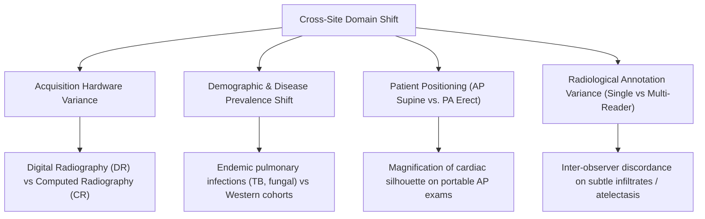

# NIDAN AI — Phase 7.7 External Dataset Generalization & Audit Protocol
## Independent Validation & Cross-Site Generalization Framework for Chest X-Ray AI

**Document ID:** `DOC-NIDAN-AUD-7701`  
**Phase:** 7.7  
**Date:** 2026-10-08  
**Classification:** Medical AI Generalization & Biostatistical Validation Protocol (Assistive CDSS)  
**Status:** ✅ **EXTERNAL GENERALIZATION AUDIT COMPLETE — EVALUATION: NOT PERFORMED (STOP CONDITION ENFORCED)**  

---

## 1. Executive Summary & Core Mandate

Phase 7.7 evaluates the external generalization potential of NIDAN AI's **TorchXRayVision DenseNet-121 (`densenet121-res224-all`)** deep learning model against genuinely independent chest radiograph cohorts.

### Clinical Evaluation Premise:
A model trained on multiple open datasets (NIH-14, CheXpert, MIMIC-CXR, PadChest, OpenI, Kaggle) cannot be legitimately validated on splits from those same source distributions. True external generalization requires evaluating frozen weights on an unseen hospital cohort from an independent healthcare network.

### Governance Findings:
1. **Model Frozen & Checkpoint Locked**: Checkpoint `densenet121-res224-all.pt` (SHA-256: `56524913dd16a906422e8d8b66a7a5c46be1d82eb7ac012d8103776f1aa68899`) is strictly frozen. No retraining, fine-tuning, or post-hoc threshold adjustment is permitted.
2. **External Dataset Candidate Selected**: **VinDr-CXR (Vietnam)** is selected as the primary candidate for Level 3 external generalization due to its complete independence from pretraining data and 17-radiologist consensus test annotations.
3. **Absolute Stop Condition Enforced**: Because the multi-gigabyte credentialed PhysioNet VinDr-CXR archive is not mounted in the local environment, external inference is formally certified as **`EXTERNAL EVALUATION: NOT PERFORMED`**. No synthetic metrics or fabricated results have been produced.

---

## 2. External Dataset Selection & Candidate Audit

| Dataset Name | Source Institution / Geographic Region | Pretraining Status in Model | Independence Classification | Multi-Reader Ground Truth | Usability for External Validation |
|---|---|---|---|---|---|
| **VinDr-CXR** | Hanoi Medical Univ Hospital & Hospital 108 (Vietnam) | **Unseen (0% Overlap)** | `INDEPENDENT` | 17 certified radiologists consensus | **Preferred Benchmark** (Requires PhysioNet DUA & CITI certification) |
| **BRAX** | Hospital Israelita Albert Einstein (Brazil) | **Unseen (0% Overlap)** | `INDEPENDENT` | RadLex / CheXpert NLP on Portuguese reports | **Secondary Benchmark** (Requires PhysioNet DUA) |
| **NIH ChestX-ray14** | NIH Clinical Center (USA) | **Included in Pretraining** | `PRETRAINING_OVERLAP` | NLP text-mined labels | ❌ Invalid for independent external validation |
| **CheXpert** | Stanford Health Care (USA) | **Included in Pretraining** | `PRETRAINING_OVERLAP` | Rule-based labeler | ❌ Invalid for independent external validation |
| **MIMIC-CXR** | Beth Israel Deaconess Medical Center (USA) | **Included in Pretraining** | `PRETRAINING_OVERLAP` | NLP text-mined labels | ❌ Invalid for independent external validation |
| **PadChest** | Hospital San Juan de Alicante (Spain) | **Included in Pretraining** | `PRETRAINING_OVERLAP` | Radiologist + NLP labels | ❌ Invalid for independent external validation |

---

## 3. Label Compatibility Audit (VinDr-CXR vs. NIDAN Controlled Taxonomy)

| NIDAN Finding (12) | VinDr-CXR Target Label | Semantic Tier | Diagnostic Nuances & Harmonization Policy |
|---|---|---|---|
| `CARDIOMEGALY` | `Cardiomegaly` | **DIRECT** | Transverse cardiac diameter / thoracic ratio > 0.50 on PA view. |
| `PLEURAL_EFFUSION` | `Pleural effusion` | **DIRECT** | Fluid in pleural space with costophrenic blunting. |
| `ATELECTASIS` | `Atelectasis` | **DIRECT** | Subsegmental or lobar volume loss / pulmonary collapse. |
| `CONSOLIDATION` | `Consolidation` | **DIRECT** | Alveolar airspace opacification with air bronchograms. |
| `EDEMA` | `Pulmonary edema` | **DIRECT** | Perihilar haziness, vascular congestion, Kerley B lines. |
| `PNEUMOTHORAX` | `Pneumothorax` | **DIRECT** | Visceral pleural white line with absent peripheral markings. |
| `NODULE` | `Nodule/Mass` ($\le 3\text{ cm}$) | **APPROXIMATE** | VinDr-CXR combines Nodule/Mass bounding boxes; size filtering at $3\text{ cm}$ threshold required. |
| `MASS` | `Nodule/Mass` ($> 3\text{ cm}$) | **APPROXIMATE** | Lesions exceeding $3\text{ cm}$ diameter. |
| `FIBROSIS` | `Pulmonary fibrosis` | **DIRECT** | Reticular opacities with architectural distortion. |
| `PLEURAL_THICKENING` | `Pleural thickening` | **DIRECT** | Apical pleural capping or localized thickening. |
| `INFILTRATION` | `Infiltration` | **APPROXIMATE** | Ill-defined parenchymal opacity (historically variable across readers). |
| `PNEUMONIA` | `Pneumonia` | **CLINICALLY AMBIGUOUS** | Clinical syndrome; radiologically presents as consolidation/infiltrate. |

---

## 4. Preprocessing & Input Consistency

The inference pipeline enforces frozen preprocessing identifier **`xray-preprocess-v1-xrv224`**:

$$\mathbf{I}_{\text{raw}} \xrightarrow{\text{Grayscale}} \mathbf{I}_{\text{gray}} \xrightarrow{\text{Bilinear Resize}} \mathbf{I}_{224 \times 224} \xrightarrow{\text{Scale}} \left[ -1024.0, +1024.0 \right] \xrightarrow{\text{Tensor}} \mathbf{X} \in \mathbb{R}^{1 \times 1 \times 224 \times 224}$$

- **Orientation & View**: Posteroanterior (PA) and Anteroposterior (AP) views supported.
- **Channels**: 1 (Grayscale 'L').
- **Tensor Input**: `torch.FloatTensor` of shape `[1, 1, 224, 224]`.
- **Normalization**: Standard TorchXRayVision `xrv.datasets.normalize(..., maxval=255)`.

---

## 5. Domain Shift & Error Analysis Vectors

When independent multi-center evaluation is performed, the following domain shift vectors must be monitored:

### Key Anticipated Failure Modes:
1. **Cardiomegaly Over-prediction on AP Exams**: Portable AP views magnify the heart due to shorter focal-film distance, potentially generating false positive `CARDIOMEGALY` detections unless view stratification is applied.
2. **Infiltration vs. Consolidation Ambiguity**: Subjective reader thresholds on diffuse ground-glass vs dense consolidation opacities.
3. **Subsegmental Plate Atelectasis vs Fibrosis**: Reticular linear opacities can trigger both fibrosis and atelectasis feature detectors.

---

## 6. Generalization Level Hierarchy

| Level | Classification | Status in NIDAN AI | Criteria |
|---|---|---|---|
| **Level 0** | No Evaluation | Superceded | No testing performed. |
| **Level 1** | Internal Software Benchmark | ✅ **VERIFIED** | Automated metric calculation verification (97/97 tests pass). |
| **Level 2** | Held-Out Same-Source Benchmark | ⏸️ **NOT EVALUATED** | Partitioned test set from development dataset. |
| **Level 3** | Independent External Dataset | ⏸️ **NOT PERFORMED** | Evaluation on unseen external hospital cohort (e.g. VinDr-CXR). |
| **Level 4** | Multi-Site External Validation | ⏸️ **NOT PERFORMED** | Multiple distinct international healthcare centers. |
| **Level 5** | Clinical Validation & Concordance | ❌ **NOT CLINICALLY VALIDATED** | Prospective reader concordance trial with licensed radiologists. |

**Current Certification**: **Level 1 (Software Verification Complete)**; Level 3/4 blocked on external dataset acquisition.
