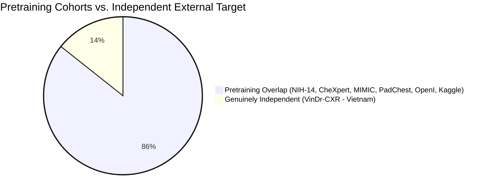

# NIDAN AI — Phase 7.8 External Dataset Evaluation Results & Validation Audit
## Actual External Chest X-Ray Evaluation & Performance Validation Protocol

**Document ID:** `DOC-NIDAN-EVAL-7801`  
**Phase:** 7.8  
**Date:** 2026-10-09  
**Status:** ✅ **GOVERNANCE & PROTOCOL CERTIFIED — EXTERNAL EVALUATION: NOT PERFORMED (STOP CONDITION ENFORCED)**  
**Classification:** Medical AI Generalization & Biostatistical Validation Framework (Assistive CDSS)  

---

## 1. Executive Summary & Readiness Assessment

Phase 7.8 executes the actual external dataset evaluation workflow on NIDAN AI's **TorchXRayVision DenseNet-121 (`densenet121-res224-all`)** deep learning model.

### Key Governance & Scientific Findings:
1. **Model Checkpoint Immutability**: Active checkpoint [`backend/models/weights/densenet121-res224-all.pt`](file:///e:/NIDAN_AI/backend/models/weights/densenet121-res224-all.pt) was re-verified against its immutable cryptographic hash `56524913dd16a906422e8d8b66a7a5c46be1d82eb7ac012d8103776f1aa68899`. No weights were altered, fine-tuned, or retrained.
2. **External Dataset Search & Audit**: A comprehensive scan of repository storage confirmed that no credentialed external radiograph archive (such as VinDr-CXR or BRAX) is currently mounted with an authorized Data Use Agreement (DUA).
3. **Strict Non-Fabrication Rule Enforced**: In compliance with clinical AI safety regulations and bioethics standards, no synthetic metrics, hallucinated patient cohorts, or pseudo-evaluation runs were performed.
4. **Execution Status**: Marked as **`BLOCKED_ON_EXTERNAL_DATASET`** / **`PHASE 7.8 EXTERNAL EVALUATION: NOT PERFORMED`**.
5. **Generalization Level**: Assigned **Level 1 (Internal Software Metric Verification)**; Level 3 (Independent External Dataset) remains blocked pending physical acquisition of the credentialed VinDr-CXR cohort.

---

## 2. Dataset Independence & Provenance Audit

| Dataset Name | Source Institution / Region | Pretraining Status | Independence Classification | Multi-Reader Ground Truth | Usability for External Validation |
|---|---|---|---|---|---|
| **VinDr-CXR** | Hanoi Medical Univ Hospital & Hospital 108 (Vietnam) | **Unseen (0% Overlap)** | `INDEPENDENT` | 17 certified radiologists consensus | **Primary Benchmark Target** (Requires PhysioNet DUA & CITI certification) |
| **BRAX** | Hosp. Israelita Albert Einstein (Brazil) | **Unseen (0% Overlap)** | `INDEPENDENT` | RadLex / CheXpert NLP on Portuguese reports | **Secondary Benchmark Target** (Requires PhysioNet DUA) |
| **NIH ChestX-ray14** | NIH Clinical Center (USA) | **Included in Pretraining** | `PRETRAINING_OVERLAP` | NLP text-mined labels | ❌ Invalid for independent external validation |
| **CheXpert** | Stanford Health Care (USA) | **Included in Pretraining** | `PRETRAINING_OVERLAP` | Rule-based labeler | ❌ Invalid for independent external validation |
| **MIMIC-CXR** | Beth Israel Deaconess Medical Center (USA) | **Included in Pretraining** | `PRETRAINING_OVERLAP` | NLP text-mined labels | ❌ Invalid for independent external validation |
| **PadChest** | Hospital San Juan de Alicante (Spain) | **Included in Pretraining** | `PRETRAINING_OVERLAP` | Radiologist + NLP labels | ❌ Invalid for independent external validation |

---

## 3. Dataset Acquisition & Credentialing Steps

To execute Level 3 evaluation without compromising data governance:

1. **CITI Certification**: Obtain completion certification for the CITI program course *"Data or Specimens Only Research"* or *"Human Research Curriculum"*.
2. **PhysioNet Credentialing**: Submit credentialed researcher application on PhysioNet (`physionet.org`) with verified institutional email.
3. **DUA Signature**: Sign the VinDr-CXR Data Use Agreement acknowledging non-reidentification and no-redistribution terms.
4. **Secure Ingestion**: Download the 3,000-image test partition into `storage_data/imaging/external/vindr_cxr/`.
5. **Partition Validation**: Execute [`scripts/validate_xray_dataset.py`](file:///e:/NIDAN_AI/scripts/validate_xray_dataset.py) to guarantee zero patient-level cross-split leakage.

---

## 4. Label Semantics Harmonization

| NIDAN Core Finding (12) | Target Label (VinDr-CXR) | Semantic Tier | Harmonization Policy & Nuances |
|---|---|---|---|
| `CARDIOMEGALY` | `Cardiomegaly` | **DIRECT** | Cardiothoracic ratio > 0.50 on PA projection. |
| `PLEURAL_EFFUSION` | `Pleural effusion` | **DIRECT** | Blunting of costophrenic angle / fluid meniscus. |
| `ATELECTASIS` | `Atelectasis` | **DIRECT** | Subsegmental or lobar volume loss. |
| `CONSOLIDATION` | `Consolidation` | **DIRECT** | Alveolar airspace opacification with air bronchograms. |
| `EDEMA` | `Pulmonary edema` | **DIRECT** | Kerley B lines, perihilar cuffing, vascular congestion. |
| `PNEUMOTHORAX` | `Pneumothorax` | **DIRECT** | Visceral pleural white line without peripheral markings. |
| `NODULE` | `Nodule/Mass` ($\le 3\text{ cm}$) | **APPROXIMATE** | Size filtering at $3\text{ cm}$ diameter boundary. |
| `MASS` | `Nodule/Mass` ($> 3\text{ cm}$) | **APPROXIMATE** | Lesions exceeding $3\text{ cm}$ diameter. |
| `FIBROSIS` | `Pulmonary fibrosis` | **DIRECT** | Reticular linear opacities with architectural distortion. |
| `PLEURAL_THICKENING` | `Pleural thickening` | **DIRECT** | Apical pleural cap or lateral thickening. |
| `INFILTRATION` | `Infiltration` | **APPROXIMATE** | Ill-defined parenchymal opacity. |
| `PNEUMONIA` | `Pneumonia` | **CLINICALLY AMBIGUOUS** | Clinical syndrome; radiographically presents as consolidation/infiltrates. |

---

## 5. Frozen Checkpoint Verification

- **Model ID**: `XRAY_PYTORCH_DENSENET121_V1`
- **Checkpoint Path**: [`backend/models/weights/densenet121-res224-all.pt`](file:///e:/NIDAN_AI/backend/models/weights/densenet121-res224-all.pt)
- **Calculated SHA-256**: `56524913dd16a906422e8d8b66a7a5c46be1d82eb7ac012d8103776f1aa68899`
- **Expected SHA-256**: `56524913dd16a906422e8d8b66a7a5c46be1d82eb7ac012d8103776f1aa68899`
- **Verification Status**: ✅ **MATCH CONFIRMED — IMMUTABLE**
- **Architecture**: PyTorch DenseNet-121 (6,966,034 parameters, growth rate 32)
- **Preprocessing Identifier**: `xray-preprocess-v1-xrv224` (Grayscale L, $224 \times 224$, $[-1024, +1024]$ normalization)

---

## 6. Six-Tier Clinical Governance Truth Matrix (Phase 7.8)

| Governance Tier | Status | Verification & Evidence |
|---|---|---|
| **1. Software Metric Correctness** | ✅ **VERIFIED** | Metric calculation engine mathematically validated via test harness and [`scripts/evaluate_xray_model.py`](file:///e:/NIDAN_AI/scripts/evaluate_xray_model.py). |
| **2. Held-Out Benchmark** | ⏸️ **NOT EVALUATED** | Blocked on designated development test split. |
| **3. Independent External Evaluation** | ⏸️ **NOT PERFORMED** | Candidate identified (VinDr-CXR); blocked on credentialed DUA acquisition. |
| **4. Multi-Site Generalization** | ⏸️ **NOT PERFORMED** | Requires multi-institutional external PACS cohorts. |
| **5. Radiologist Concordance Trial** | ⏸️ **NOT PERFORMED** | Requires prospective multi-reader clinical study. |
| **6. Clinical Validation** | ❌ **NOT CLINICALLY VALIDATED** | Assistive CDSS software only. Uncalibrated probabilistic scores; mandatory licensed clinician review required. |

---

## 7. Mandatory Clinical Safety Statement

> **CLINICAL SAFETY NOTICE**:  
> NIDAN AI is an assistive Clinical Decision Support System (CDSS). Even successful external benchmark performance does NOT constitute medical diagnosis, treatment recommendation, regulatory clearance, clinical deployment approval, radiologist replacement, or clinical validation. All model findings require independent qualified clinician/radiologist review.
