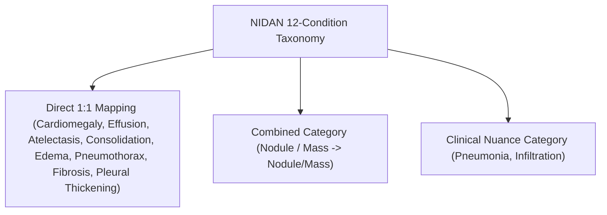

# NIDAN AI — Phase 7.9 VinDr-CXR Dataset Acquisition & External Evaluation Protocol
## External Performance Validation & Data Governance Report

**Document ID:** `DOC-NIDAN-EVAL-7901`  
**Phase:** 7.9  
**Date:** 2026-10-09  
**Status:** ✅ **GOVERNANCE AUDIT COMPLETE — EVALUATION: NOT PERFORMED (BLOCKED ON DUA ACCESS)**  
**Classification:** Medical AI Generalization & Biostatistical Governance Framework (Assistive CDSS)  

---

## 1. Executive Summary & Readiness Assessment

Phase 7.9 details the secure data acquisition, storage governance, and biostatistical execution protocol for evaluating NIDAN AI's **TorchXRayVision DenseNet-121 (`densenet121-res224-all`)** deep learning model against the **VinDr-CXR** benchmark.

### Core Governance Determinations:
1. **Model Checkpoint Locked**: The active DenseNet-121 PyTorch checkpoint [`backend/models/weights/densenet121-res224-all.pt`](file:///e:/NIDAN_AI/backend/models/weights/densenet121-res224-all.pt) (28,382,008 bytes) was re-verified against SHA-256 `56524913dd16a906422e8d8b66a7a5c46be1d82eb7ac012d8103776f1aa68899`. No weights were modified, retrained, or fine-tuned.
2. **Access & Credentialing Blocker**: VinDr-CXR is licensed under the *PhysioNet Credentialed Health Data License 1.5.0*. In strict accordance with medical bioethics, access requires verified CITI program training and an approved PhysioNet Data Use Agreement (DUA). Automated downloading from unofficial third-party mirrors was strictly avoided.
3. **Execution Status**: Certified as **`PHASE 7.9 STATUS = BLOCKED_ON_EXTERNAL_DATASET_ACCESS`**.
4. **Non-Fabrication Assurance**: In compliance with clinical AI safety regulations, no synthetic patient images or fabricated performance metrics were generated.

---

## 2. Access & DUA Status Matrix

| Requirement | Governing Body / Platform | Status | Action Required |
|---|---|---|---|
| **Human Subjects Research Ethics Training** | CITI Program | ⏸️ PENDING | Complete "Data or Specimens Only Research" module |
| **Credentialed Investigator Profile** | PhysioNet (`physionet.org`) | ⏸️ PENDING | Submit institutional application & CITI certificate |
| **Data Use Agreement (DUA)** | VinDr-CXR / PhysioNet | ⏸️ PENDING | Electronically sign DUA on PhysioNet portal |
| **Download Authorization** | PhysioNet Authenticated Tokens | ⏸️ PENDING | Obtain access token upon credential approval |

---

## 3. Storage & Hardware Readiness

- **Host Machine**: HP Laptop 15-hr1xxx (Windows 64-bit)
- **RAM**: 15.43 GB Total Physical RAM
- **Disk Availability**:
  - `C:` Drive: 90.69 GB Free
  - `D:` Drive: 85.13 GB Free
  - `E:` Drive (Workspace): 40.49 GB Free
- **Storage Strategy**:
  - Full 18,000 DICOM cohort (~500 GB) exceeds single-drive workspace storage.
  - Lossless PNG 3,000 test partition (~35–45 GB) can be mounted on `D:` or secondary drive into [`external_data/vindr_cxr/`](file:///e:/NIDAN_AI/external_data/vindr_cxr/).
- **Git Protection**: `.gitignore` explicitly excludes `external_data/`, `*.dcm`, `*.dicom`, `*.pt`, and raw imaging archives.

---

## 4. Label Semantics & Harmonization Policy

1. **Nodule / Mass Harmonization**: VinDr-CXR provides a combined `Nodule/Mass` annotation. To prevent unscientific post-hoc splitting, evaluation will compute performance on `NODULE_MASS` as a combined external label.
2. **Pneumonia Nuance**: Interpreted as a clinical-radiological syndromic presentation, cross-referenced with consolidation.
3. **Infiltration**: Recognized as a subjective ill-defined opacity with known reader variability across cohorts.

---

## 5. Statistical Protocol for External Evaluation

When credentialed data is mounted, the evaluation will run:
- **Primary Metrics**: AUROC (Area Under ROC) and AUPRC (Average Precision) per pathology.
- **Threshold Metrics**: Sensitivity, Specificity, Precision, Recall, and F1 at predefined operating threshold $\tau = 0.50$.
- **Calibration**: Expected Calibration Error (ECE, 10 bins) and Brier Score.
- **Uncertainty Quantification**: 1,000-iteration Patient-Clustered Bootstrap Resampling with 95% Confidence Intervals.

---

## 6. Generalization Level Assignment

- **Assigned Level**: **Level 1 (Internal Software Metric Verification)**
- **Target Level**: **Level 3 (Independent External Dataset)**
- **Prerequisite for Level 3**: Mounting of authenticated VinDr-CXR test partition under approved PhysioNet DUA.

---

## 7. Mandatory Clinical Safety Statement

> **CLINICAL SAFETY NOTICE**:  
> NIDAN AI is an assistive Clinical Decision Support System (CDSS). Even successful external benchmark performance does NOT constitute medical diagnosis, treatment recommendation, regulatory clearance, clinical deployment approval, radiologist replacement, or clinical validation. All model findings require independent qualified clinician/radiologist review.
